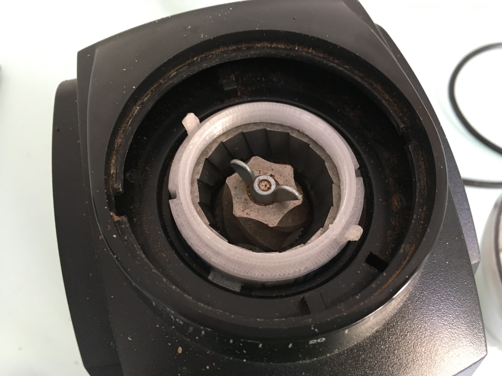
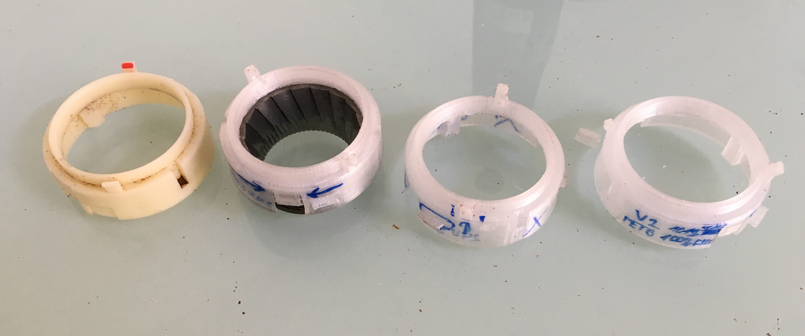

# 🇨🇿 Držák horního mlecího kamene mlýnku Baratza Encore
Model náhradního držáku mlecího kamene pro mlýnek na kávová zrna Baratza Encore tisknutelný na 3D tiskárně.
### Instrukce pro sestavení
1. Zkompilovat v OpenSCAD nebo stáhnout hotový STL soubor
2. Vytisknout z plastu vhodného pro styk s jídlem (bezbarvý PET, XT apod.) s podporami převisů
3. Zbrousit podle potřeby horní výběžky pro silikonový násyp, aby pasoval
4. Zbrousit postranní výběžky na tloušťku 1,2mm (tisknou se tlustší aby byly pevnější)
5. Náhradní díl je hotový!

# 🇬🇧 Baratza Encore Burr Holder
3D printable model of replacement burr holder for Baratza Encore coffee bean grinder
### Build instructions
1. Compile in OpenSCAD or download STL file
2. Print from material suitable for food contact (natural PET, XT etc.) and with overhang supports
3. Grind upper tabs for the silicone hopper according to need
4. Grind side tabs to 1.2mm thickness (they are intentionally printed thicker to be stronger)
5. Replacement part is done!

 
## Photos
### Installed part
 
### Design progress

 
 This work is licensed under a <a rel="license" href="http://creativecommons.org/licenses/by-nc-sa/4.0/">Creative Commons Attribution-NonCommercial-ShareAlike 4.0 International License</a>.